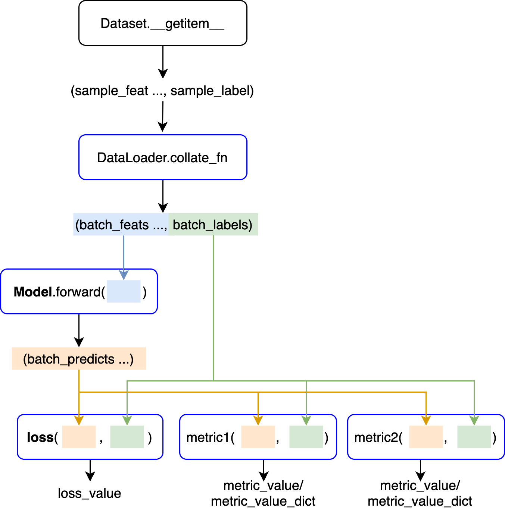

# torchility

A Pytorch-lightning based tool for training pytorch deep learning model more simply.

## Install

- `pip install torchility`
### Dependency
- pytorch>=2.0
- pytorch-lightning>=2.0,<2.1
- torchmetrics>=0.11,<0.12
- matplotlib>=3.3
- pyyaml>=5.4
- tensorboardX>=2.6

## Usage

### Example

- MNIST

```python
from torchility import Trainer
import torch
from torch import nn
from torch.nn import functional as F
from torchvision.datasets import MNIST
from torchvision import transforms
from torch.utils.data import DataLoader, random_split
import warnings
warnings.simplefilter("ignore")  # ignore annoying warnings

# datasets
data_dir = './datasets'
transform = transforms.Compose([transforms.ToTensor(), transforms.Normalize((0.1307,), (0.3081,))])
mnist_full = MNIST(data_dir, train=True, transform=transform, download=True)
train_ds, val_ds = random_split(mnist_full, [55000, 5000])
test_ds = MNIST(data_dir, train=False, transform=transform, download=True)

# dataloaders
train_dl = DataLoader(train_ds, batch_size=32)
val_dl = DataLoader(val_ds, batch_size=32)
test_dl = DataLoader(test_ds, batch_size=32)

# pytorch model
channels, width, height = (1, 28, 28)
model = nn.Sequential(
    nn.Flatten(),
    nn.Linear(channels * width * height, 64),
    nn.ReLU(),
    nn.Dropout(0.1),
    nn.Linear(64, 64),
    nn.ReLU(),
    nn.Dropout(0.1),
    nn.Linear(64, 10)
)

# optimizer
opt = torch.optim.Adam(model.parameters(), lr=2e-4)
# trainer
trainer = Trainer(model, F.cross_entropy, opt, epochs=2)
# train and validate
trainer.fit(train_dl, val_dl)
# test
trainer.test(test_dl)
```

- See the `examples` for more examples 

### Data Flow




